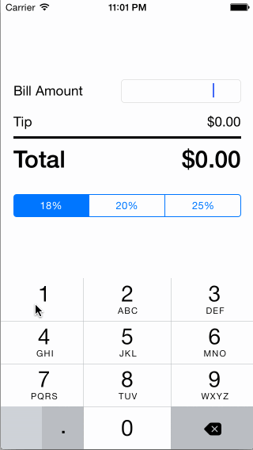

# Tip Calculator
=======================================
This is an iOS application for calculating tips.

Time spent: 2 hours

Completed User Stories:
* [x] Required: User can calculate tips from a fixed set of percentages

Notes:

Took some time to watch the how-to video (https://vimeo.com/102084767) and familiarize myself with XCode. Additionally spent some time figuring out how to instantiate Objective-C global variables for the NSNumberFormatterStyle.

Walkthrough of all user stories:

GIF created with [LiceCap](http://www.cockos.com/licecap/).
